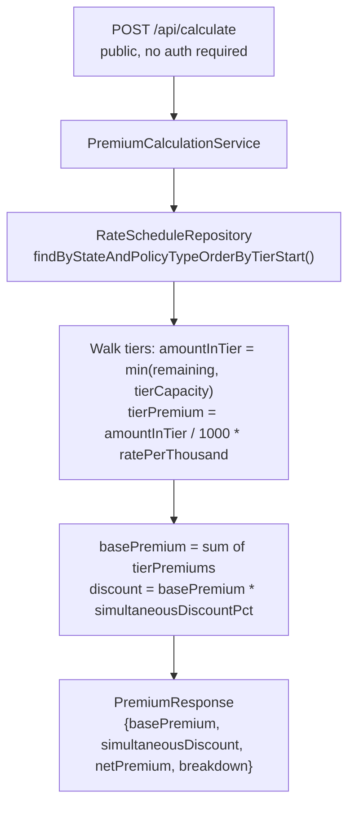

# TitleRate (Java)


Title insurance premium calculator for PA and NJ. Spring Boot 3.3, Spring Security stateless JWT, Spring Data JPA, PostgreSQL. 31 tests (JUnit 5, MockMvc, a real embedded server for the responses an anonymous caller gets, and Testcontainers Postgres throughout). No persistent live URL: run locally with `docker compose up` or deploy via Terraform to ECS Fargate (see `infra/`).

## Problem

Title insurance premiums follow state-filed tiered rate schedules with different rates at different property value bands. Lender policies issued simultaneously with owner policies receive a discount. Quoting the correct premium requires looking up the applicable tier from the filed schedule.

## Solution

A REST API that walks the full tier list for a given state and policy type, accumulating premium across rate brackets. Each tier covers a property value band; only the amount within that band is rated at the tier's `ratePerThousand`. The final `basePremium` is the sum across all tiers (the same math as tax bracket accumulation). Simultaneous issue discount applies to the accumulated base.

## Architecture



Open-ended final tiers (null `tierEnd`) absorb all remaining amount. The `breakdown` field in the response lists each tier's contribution for auditability.

## Tech Stack

| Layer | Technology | Why |
|---|---|---|
| Runtime | Spring Boot 3.3, Java 19 | Familiar enterprise Java stack; JPA + Hibernate for schema management |
| Auth | Spring Security stateless + JJWT 0.12.6 | `OncePerRequestFilter` validates Bearer tokens; no session state |
| ORM | Spring Data JPA + Hibernate | JPQL tier query. Flyway owns the schema; Hibernate runs `ddl-auto=validate` and refuses to boot if the entities drift from it |
| Passwords | BCrypt (Spring Security) | Industry-standard hashing with cost factor |
| Tests | JUnit 5, MockMvc, Testcontainers | Integration tests run against a real Postgres container, so the migrations are exercised in the dialect production uses; `@Sql(test-rates.sql)` narrows the seed per test class |
| DB | PostgreSQL 16 | Same engine in tests and production. H2 was dropped when Flyway took over the schema, since migrations written to satisfy both engines would never exercise either properly |
| Infrastructure | AWS ECS Fargate, RDS PostgreSQL 17, ALB | Zero EC2 management; deployment circuit breaker rolls back on health-check failure |
| IaC | Terraform 1.9, GitHub Actions OIDC | Reproducible infra; CI deploys via short-lived IAM role, no stored AWS credentials |

## Getting Started

```bash
cp .env.example .env      # fill in JWT_SECRET
docker compose up -d db   # start PostgreSQL on :5434
./mvnw spring-boot:run    # starts on :8080
```

Calculate a PA lender policy for $150,000:

```bash
curl -X POST http://localhost:8080/api/calculate \
  -H "Content-Type: application/json" \
  -d '{"state":"PA","policyType":"LENDER","amount":150000,"simultaneousIssue":false}'
```

Register and get a JWT:

```bash
curl -X POST http://localhost:8080/api/auth/register \
  -H "Content-Type: application/json" \
  -d '{"email":"test@example.com","password":"password123"}'
```

The only endpoint that actually requires the JWT is `GET /api/auth/me`, which resolves the caller's own profile from the token's role claim, never from a request parameter:

```bash
curl http://localhost:8080/api/auth/me -H "Authorization: Bearer <token>"
```

Or with Docker Compose:

```bash
cp .env.example .env
docker compose up
```

## Running Tests

```bash
./mvnw test
```

## Known Limitations

- Rate schedules are illustrative tiers for PA and NJ. Verify against current state filings before production use.
- `ddl-auto=validate` is a structural check, not a type check. Measured: a renamed table or column fails the boot, but changing a column from `timestamp with time zone` to `timestamp` does not, so a type drifting from its entity will not be caught.
- No rate schedule update API; changes require a migration or seed update.
- Multi-state test coverage is limited: only PA tiers are seeded in the current test fixtures.

## License

MIT
