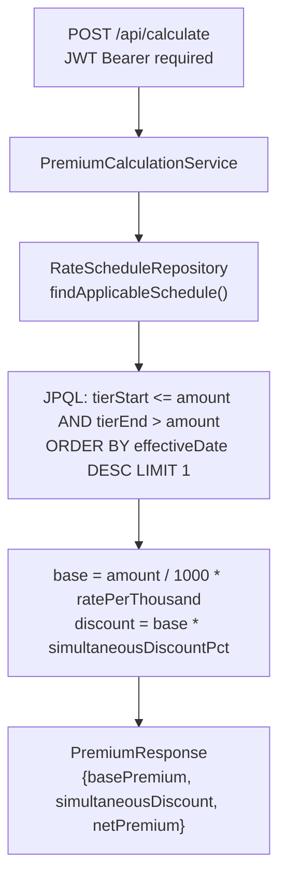

# TitleRate (Java)


Title insurance premium calculator for PA and NJ. Spring Boot 3.3, Spring Security stateless JWT, Spring Data JPA, PostgreSQL. 12 tests (JUnit 5 + MockMvc).

## Problem

Title insurance premiums follow state-filed tiered rate schedules with different rates at different property value bands. Lender policies issued simultaneously with owner policies receive a discount. Quoting the correct premium requires looking up the applicable tier from the filed schedule.

## Solution

A REST API with a JPQL tier query that finds the applicable rate schedule row for a given state, policy type, and property value. The premium is computed as `amount / 1000 * rate_per_thousand`, with the simultaneous issue discount applied when both coverages are requested.

## Architecture



Tier boundaries use exclusive upper bounds (JPQL `tierEnd > amount`): the tier whose `tierStart <= amount < tierEnd` applies. An amount exactly at a tier boundary falls into the higher tier.

## Tech Stack

| Layer | Technology | Why |
|---|---|---|
| Runtime | Spring Boot 3.3, Java 19 | Familiar enterprise Java stack; JPA + Hibernate for schema management |
| Auth | Spring Security stateless + JJWT 0.12.6 | `OncePerRequestFilter` validates Bearer tokens; no session state |
| ORM | Spring Data JPA + Hibernate | JPQL tier query; `schema-create` in H2, `update` in prod |
| Passwords | BCrypt (Spring Security) | Industry-standard hashing with cost factor |
| Tests | JUnit 5, MockMvc, `@SpringBootTest` | Integration tests run against real H2 with `data.sql` seed data |
| DB | PostgreSQL 16 (prod), H2 (test) | H2 in-memory for fast tests; Postgres for prod with the same schema |
| Infrastructure | AWS ECS Fargate, RDS PostgreSQL 17, ALB | Zero EC2 management; deployment circuit breaker rolls back on health-check failure |
| IaC | Terraform 1.9, GitHub Actions OIDC | Reproducible infra; CI deploys via short-lived IAM role, no stored AWS credentials |

## Getting Started

```bash
cp .env.example .env      # fill in JWT_SECRET
docker compose up -d db   # start PostgreSQL on :5434
./mvnw spring-boot:run    # starts on :8080
```

Calculate a PA lender policy for $150,000:

```bash
curl -X POST http://localhost:8080/api/calculate \
  -H "Content-Type: application/json" \
  -d '{"state":"PA","policyType":"LENDER","amount":150000,"simultaneousIssue":false}'
```

Register and get a JWT:

```bash
curl -X POST http://localhost:8080/api/auth/register \
  -H "Content-Type: application/json" \
  -d '{"email":"test@example.com","password":"password123"}'
```

Or with Docker Compose:

```bash
cp .env.example .env
docker compose up
```

## Running Tests

```bash
./mvnw test
```

## Known Limitations

- Single-tier lookup per policy: the JPQL query returns one applicable rate schedule row per request. Multi-tier calculations (walking brackets across a property value) are handled in the .NET version; this API is single-tier by design.
- Rate schedules are illustrative tiers for PA and NJ. Verify against current state filings before production use.
- H2 does not support `ON CONFLICT DO NOTHING`; the `data.sql` seed omits that clause. Re-ingesting data on a running prod DB would require idempotent INSERT OR UPDATE logic.
- No rate schedule update API; changes require a migration or `data.sql` update.

## License

MIT
